◈ &nbsp; CATALOG NO. ST-001 &nbsp; • &nbsp; ARCHIVE MODE &nbsp; ◈

 

 

# SHLOK THAKKAR

CS + ECONOMICS &nbsp;•&nbsp; STATISTICS MINOR &nbsp;•&nbsp; GPA 3.91 &nbsp;•&nbsp; UIUC &nbsp;•&nbsp; MAY 2028

 

<i>Backend & distributed systems — LLM infrastructure, low-latency engines, and data-driven products.</i>

 

&nbsp;
&nbsp;

 

---

 &nbsp; NOW PLAYING &nbsp;•&nbsp; PERSONAL BUILDS & SYSTEMS &nbsp;•&nbsp; PLAYING 8 TRACKS

### PROJECTS &nbsp; `ST-001`

 

**`01`** &nbsp; [**RAFT-KV**](https://github.com/shlok1806/raft-kv) &nbsp; 
> Raft consensus implemented from scratch — leader election, log replication, snapshotting, and a 5-node fault-tolerant cluster
>
> `Go` &nbsp; `Distributed Systems` &nbsp; `Consensus` &nbsp; `RPC`

 

**`02`** &nbsp; [**LIMIT ORDER BOOK**](https://github.com/shlok1806/OrderBook) &nbsp; 
> Thread-safe C++20 order book — 5 order types, FIFO price-time priority, O(1) cancel, and ~500× FOK matching improvement
>
> `C++20` &nbsp; `Multithreading` &nbsp; `Low-Latency` &nbsp; `Market Microstructure`

 

**`03`** &nbsp; [**WHOOP-LOCAL**](https://github.com/shlok1806/whoop-local) &nbsp; 
> Local-first WHOOP 5.0 client — reverse-engineered the band's GATT profile to read live heart rate and backfill flash history straight over Bluetooth LE, with no phone and no cloud in the loop
>
> `Python` &nbsp; `Bluetooth LE` &nbsp; `Protocol Reverse Engineering` &nbsp; `bleak`

 

**`04`** &nbsp; [**CARTEL**](https://github.com/shlok1806/builders-cup) &nbsp; 
> Shared-cart expense agent — describe a purchase in plain text, an LLM builds the cart, a deterministic engine splits it against each roommate's compiled policies, and flagged lines get approved live on the owner's phone before every card is charged
>
> `Next.js` &nbsp; `TypeScript` &nbsp; `Supabase` &nbsp; `Stripe` &nbsp; `PWA`

 

**`05`** &nbsp; [**BLUEPRINT QA**](https://github.com/shlok1806/blueprint-qa) &nbsp; 
> AI quality assurance for construction & engineering PDFs — flags missing tags, dimension mismatches, and unlabeled elements via a multi-stage OCR + Claude pipeline
>
> `FastAPI` &nbsp; `Claude API` &nbsp; `SvelteKit` &nbsp; `PostgreSQL` &nbsp; `Docker`

 

**`06`** &nbsp; [**VIBESAFE**](https://github.com/shlok1806/vibesafe) &nbsp; 
> GitHub Action that runs Claude over pull requests to scan for leaked secrets and vulnerable dependencies
>
> `TypeScript` &nbsp; `GitHub Actions` &nbsp; `Claude API`

 

**`07`** &nbsp; [**SCROLL ROYALE**](https://github.com/shlok1806/ScrollClash) &nbsp; 
> 1v1 real-time iOS multiplayer game — SwiftUI + Combine, Supabase Postgres RPC, live leaderboard, and TTL match cache &nbsp;•&nbsp; Built at HackIllinois
>
> `SwiftUI` &nbsp; `Combine` &nbsp; `Supabase` &nbsp; `PostgreSQL`

 

**`08`** &nbsp; [**FEELENS**](https://github.com/shlok1806/feelens) &nbsp; 
> Stripe fee analytics — surfaces Amex premiums and international surcharges across payment flows
>
> `Next.js` &nbsp; `TypeScript` &nbsp; `Stripe`

 

─────────────────────────────── END OF TRACKLIST ───────────────────────────────

---

 &nbsp; NOW PLAYING &nbsp;•&nbsp; WORK & RESEARCH &nbsp;•&nbsp; PLAYING 5 TRACKS

### EXPERIENCE &nbsp; `ST-002`

 

**`01`** &nbsp; **Software Engineering Intern** &nbsp;·&nbsp; Stealth Startup &nbsp;·&nbsp; New York, NY &nbsp; 
> Hardened a production LLM agent with prompt-injection defenses and an adversarial regression eval suite; cut claim-research latency from 2–3 min to 30–40 s by parallelizing a two-phase LLM pipeline across 6 concurrent search calls

 

**`02`** &nbsp; **Undergraduate Research Assistant** &nbsp;·&nbsp; Parallel Programming Lab @ UIUC &nbsp; 
> Contributing to Charm++, an open-source C++ parallel runtime — implementing custom operators and broadcasting for its distributed array abstraction across nodes

 

**`03`** &nbsp; **Software Developer** &nbsp;·&nbsp; Disruption Lab @ UIUC &nbsp; 
> Turned a read-only tool into an editable platform for 40+ users with a Flask + Neo4j REST API; expanded automated tax-schema diff coverage from 7 → 27 states (+286%) for a Fortune 500 client

 

**`04`** &nbsp; **Undergraduate Research Assistant** &nbsp;·&nbsp; Dept. of Finance @ UIUC &nbsp; 
> Built an NLP entity-resolution pipeline (TF-IDF + Levenshtein) achieving a 63% firm match rate across 10M+ records

 

**`05`** &nbsp; **Software Development Intern** &nbsp;·&nbsp; IQM Corporation &nbsp;·&nbsp; Ahmedabad, India &nbsp; 
> Shipped a production FastAPI service on AWS Bedrock via LangChain — JWT auth and rate limiting, sub-30 s latency for 40+ concurrent users

 

─────────────────────────────── END OF TRACKLIST ───────────────────────────────

---

▸ &nbsp; TECHNICAL PROFICIENCIES &nbsp; • &nbsp; ST-003

### STACK

 

**LANGUAGES**

**AI / LLM**

**FRAMEWORKS & INFRA**

**DATABASES & DATA**

---

&nbsp;&nbsp;

 

◈ &nbsp; SHLOK THAKKAR &nbsp; • &nbsp; ST ARCHIVE &nbsp; • &nbsp; CATALOG 0001 &nbsp; • &nbsp; v2026 &nbsp; ◈

